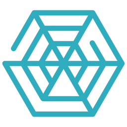

<p align="center">
  <a href="https://l3agi.com//#gh-light-mode-only">
    
  </a>
</p>

<p align="center"><i>Open-source framework to make AI agents' team collaboration as effective as human collaboration.</i></p>
    
<h3 align="center">
	<a href="https://l3agi.com?utm_medium=community&utm_source=github">Try Our Cloud</a>
   <span> | </span>
	<a href="https://www.l3agi.com?utm_medium=community&utm_source=github">Website</a>
	<span> | </span>
	<a href="./docs/basics.md">Docs</a>
	<span> | </span>
	<a href="https://discord.gg/hQ9ZWabm">Community Discord</a>
</h3>

<p align="center">
<a href="https://github.com/l3vels/L3AGI/fork" target="blank">

</a>

<a href="https://github.com/l3vels/L3AGI/stargazers" target="blank">

</a>
<a href='https://github.com/l3vels/L3AGI/releases'>

</a>

</p>

<p align="center"><b>Follow L3AGI </b></p>

<p align="center">
<a href="https://twitter.com/l3velshq" target="blank">

</a>
<a href="https://wwwhttps://github.com/orgs/l3vels/projects/1/views/1.reddit.com/r/L3AGI" target="_blank"></a>

<a href="https://discord.gg/hQ9ZWabm" target="blank">

</a>
<a href="https://www.youtube.com/@gigachkhikvadze7497" target="_blank"></a>
</p>

<p align="center"><b>Connect with the Creators </b></p>

<p align="center">
<a href="https://twitter.com/gigch_eth" target="blank">

</a>
<a href="https://twitter.com/EduardoFaraday" target="blank">

</a>
<a href="https://twitter.com/MOkradze" target="blank">

</a>
</p>

Of course! Here's the revised "Features" section with the requested emojis and in its entirety:

---

## ✨ Features

L3AGI offers a robust set of functionalities that empower you to design, supervise, and execute both autonomous AI agents and Teams of Agents. Here's what sets us apart:

- **🤖 Team of Agents**: L3AGI pioneers in facilitating the creation and management of Teams of AI Agents. These are groups of individual AI agents that collaborate seamlessly for more complex tasks and simulations.

- **🔧 Autonomous AI Agents**: Design and oversee standalone AI agents that act autonomously based on their configuration.

- **🧠 Agent Memory**: Equip your AI agents with the ability to retain and recall information, enabling them to make more informed decisions.

- **🔗 Data Sources & Integration**: 
  - Connect your AI agents to an array of data sources for efficient information retrieval and processing.
  - Integrate VectorDBs for enhanced data management and querying capabilities.
  - Employ the LlamaIndex (GPT Index) to boost the data framework for your LLM application.

<table align="center" border="0">
  <tr>
    <td align="center"><br>Postgres</td>
    <td align="center"><br>Mysql</td>
    <td align="center"><br>Files</td>
    <td align="center"><br>WebPage</td>
    <td align="center"><br>Notion</td>
    <td align="center"><br>Google Analytics</td>
    <td align="center"><br>Firebase</td>
  </tr>
</table>

- **🛠 Toolkits**: Empower your AI agents with our curated sets of tools, tailor-made for specific tasks.

<table align="center" border="0">
  <tr>
    <td align="center"><br>SERP</td>
    <td align="center"><br>Web Scraper</td>
    <td align="center"><br>DuckDuckGo</td>
    <td align="center"><br>Bing</td>
    <td align="center"><br>Wikipedia</td>
    <td align="center"><br>Arxiv</td>
    <td align="center"><br>OpenWeather</td>
  </tr>
  <tr>
    <td align="center"><br>Twilio</td>
    <td align="center"><br>Twitter</td>
    <td align="center"><br>Instagram</td>
    <td align="center"><br>Slack</td>
    <td align="center"><br>Gmail</td>
    <td align="center"><br>Google Calendar</td>
  </tr>
</table>

- **📊 Chart Generator**: Turn your data into insightful visualizations with our intuitive chart generator.

- **📄 Report Generator**: Streamline report creation with our user-friendly report generator tool.

- **🌐 Community Building**: Engage with a dynamic community to collectively enhance and refine your AI agents.

- **🖥 User Interface (UI)**: Utilize our sleek, user-friendly interface for building and managing your AI agents and their teams.

- **📡 APIs**: Robust APIs ensure smooth integration of L3AGI with other systems and support advanced customizations for your specific needs.

## 🚀 Roadmap [here](https://github.com/orgs/l3vels/projects/1)

<br>

## ⚡ Quick Start

### Pre-requisites

- Docker 🐳
- Docker Compose

1. **Clone the repository:**

   ```bash
   git clone https://github.com/l3vels/L3AGI.git
   ```

2. **Navigate to the project directory:**

   ```bash
   cd L3AGI
   ```

3. **Setup Git Hooks**

   ```bash
   chmod +x setup.sh
   ./setup.sh
   ```

   This will build and start both the React UI and FastAPI services.

4. 🐳 **Run Docker Compose:**

   ```bash
   docker-compose up --build
   ```

   This will build and start both the React UI and FastAPI services.

## Access the Services

- **React UI**: Open `http://localhost:3000` in your browser.
- **FastAPI Server**: Open `http://localhost:4000` in your browser or API client.

## Directory Structure

```
.
├── apps/
│ ├── ui/ # React UI Application
│ └── server/ # Python FastAPI Server
└── docker-compose.yml # Main Docker Compose File
```

## Troubleshooting

- If you encounter issues when starting the services, ensure Docker and Docker Compose are installed and up to date.
- Check the logs for any service-specific errors.

## Contributors

[](https://github.com/Chkhikvadze)
[](https://github.com/MOkradze)
[](https://github.com/edufaraday)
[](https://github.com/levanion)
