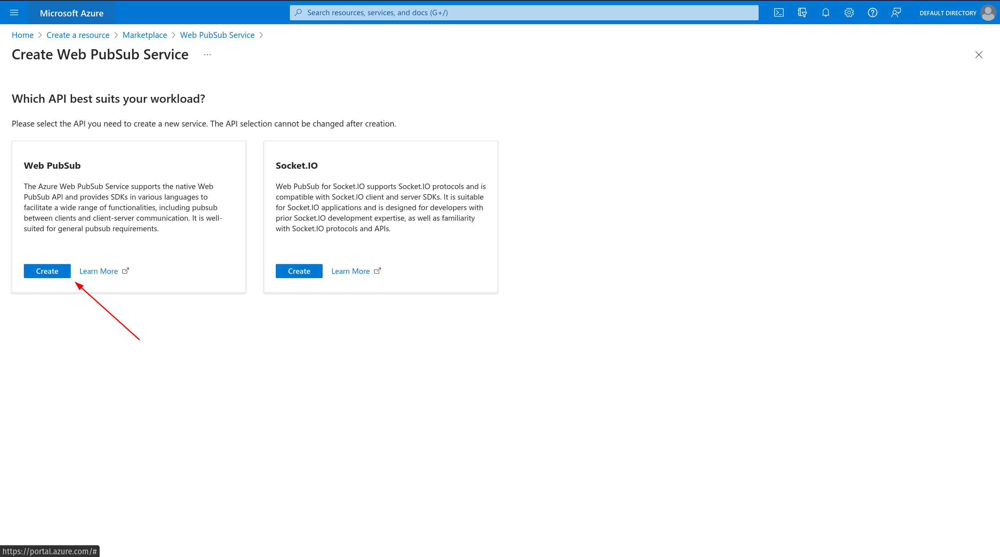
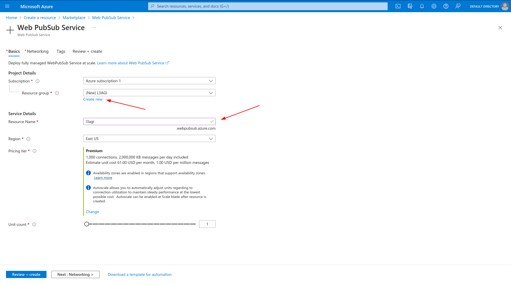
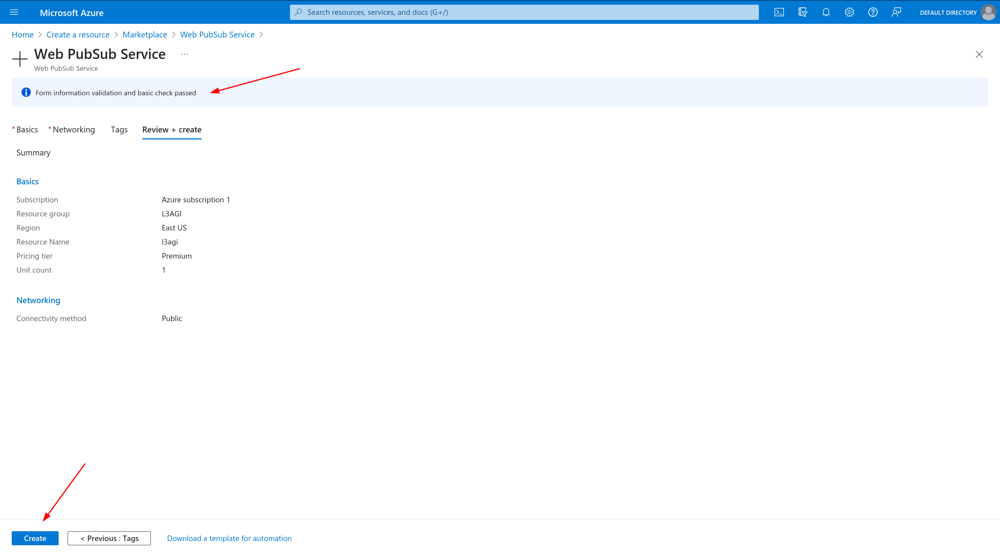
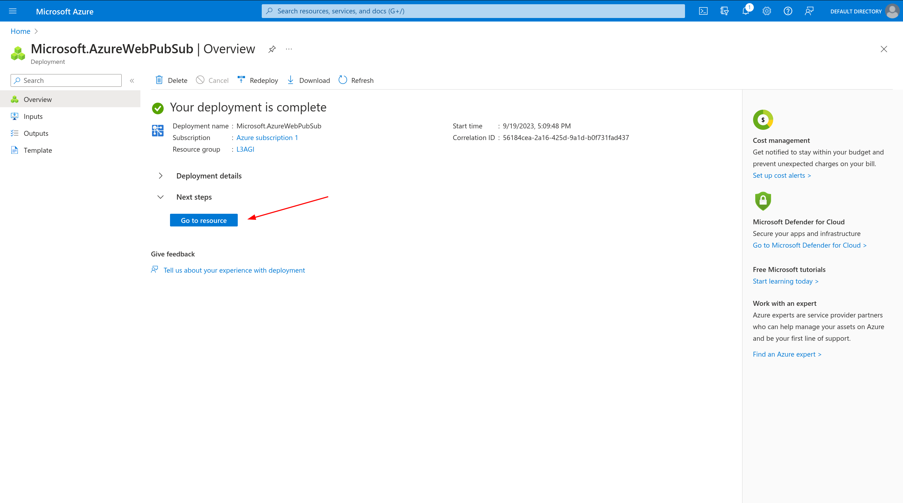
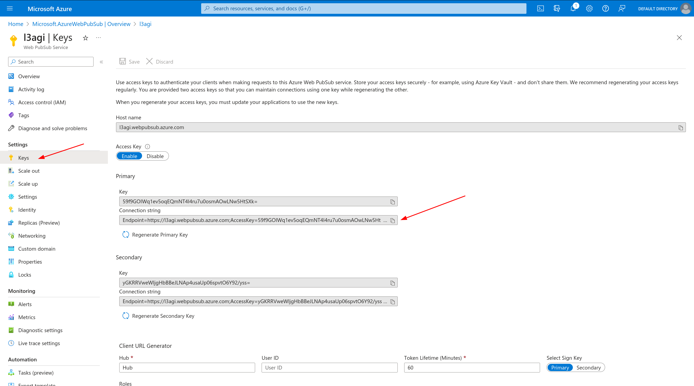
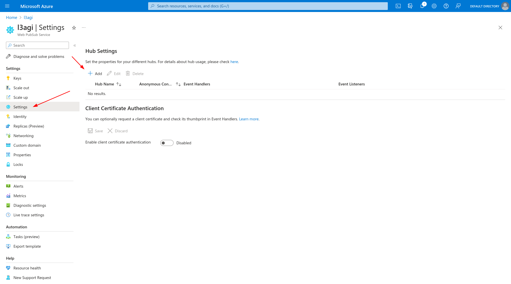
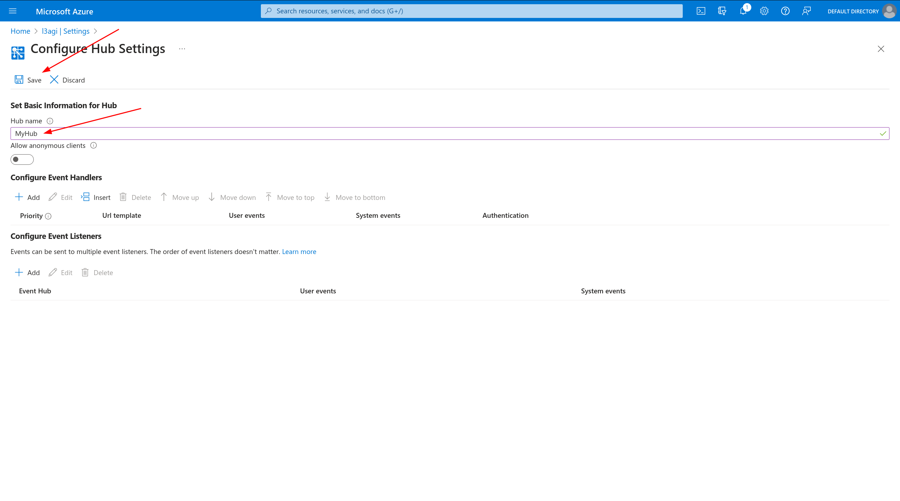

# Setup Azure Web PubSub Service from UI

1. Create a free account on [Azure](https://azure.microsoft.com/en-us/free).

2. Go to [Azure Portal](https://portal.azure.com/#home)

3. Create Web PubSub Service on [Azure Portal](https://portal.azure.com/#create/Microsoft.AzureWebPubSub)
   Choose first option:
   

4. Create a new resource group and choose name for your pubsub service:
   

5. Click `Review + create`

6. Wait for validation and then click `Create`
   

7. After creating, you will be redirected. Click `Go to resource`:
   

8. Go to `Keys` and copy `Connection string`:
   

9. Paste `Connection string` in `.env` file.

10. Go to `Settings` and create new `Hub`:
    
    

11. Paste hub name in `.env` file.

For more information visit: [Azure Web PubSub Service](https://docs.microsoft.com/en-us/azure/azure-web-pubsub/overview)
