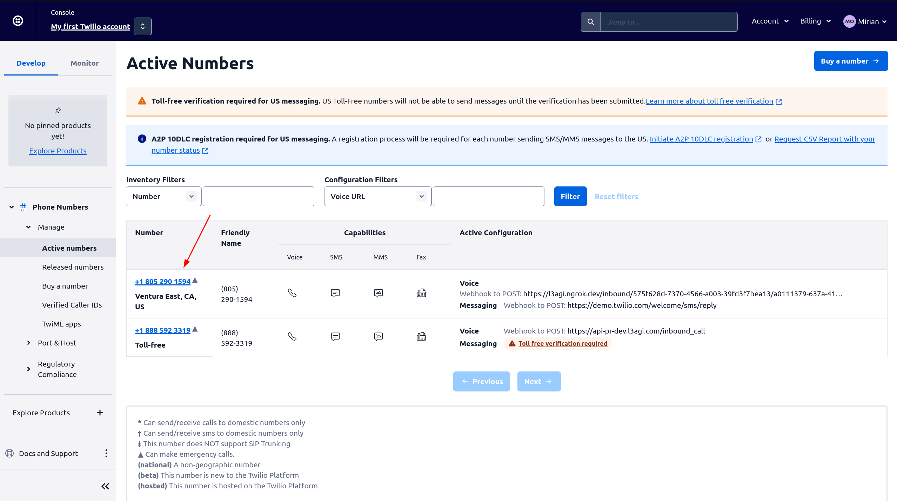
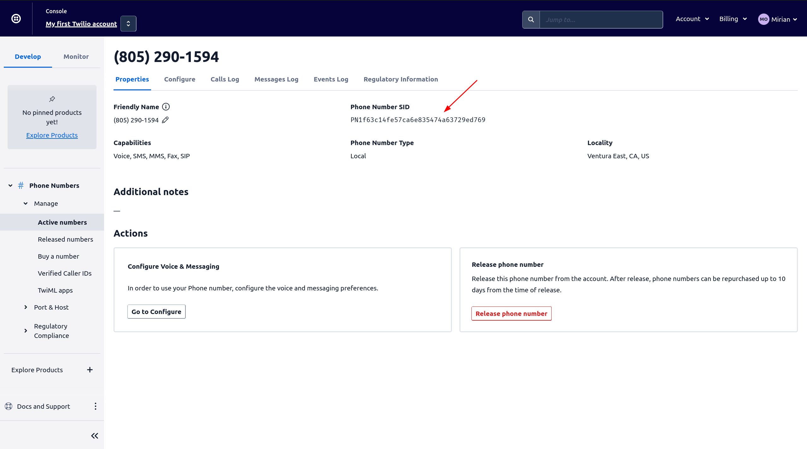

# Get Twilio Phone Number SID

To setup inbound/incoming calls with Twilio, you need to have a Twilio phone number and set it up in agent configuration.

This guide will show you how to get the SID of your Twilio phone number.

1. Go to [Twilio Console](https://console.twilio.com) and login to your account.
2. Go to [Phone Numbers](https://www.twilio.com/console/phone-numbers/incoming) page and open phone number details.
   

3. Copy Phone Number SID
   
